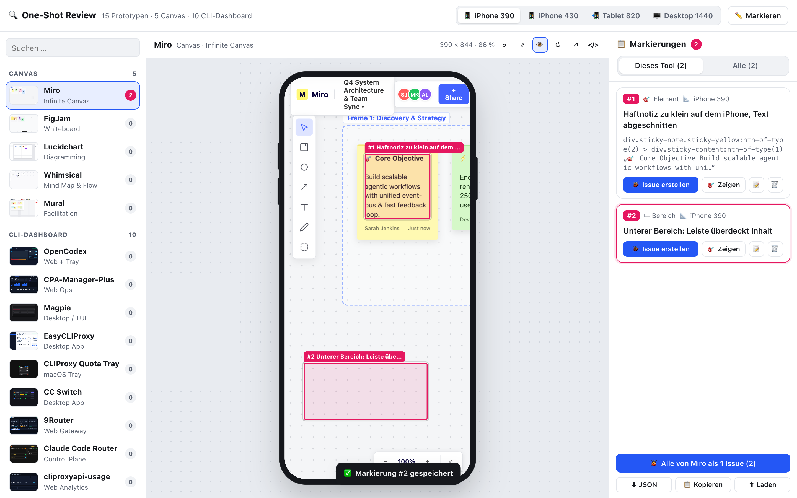
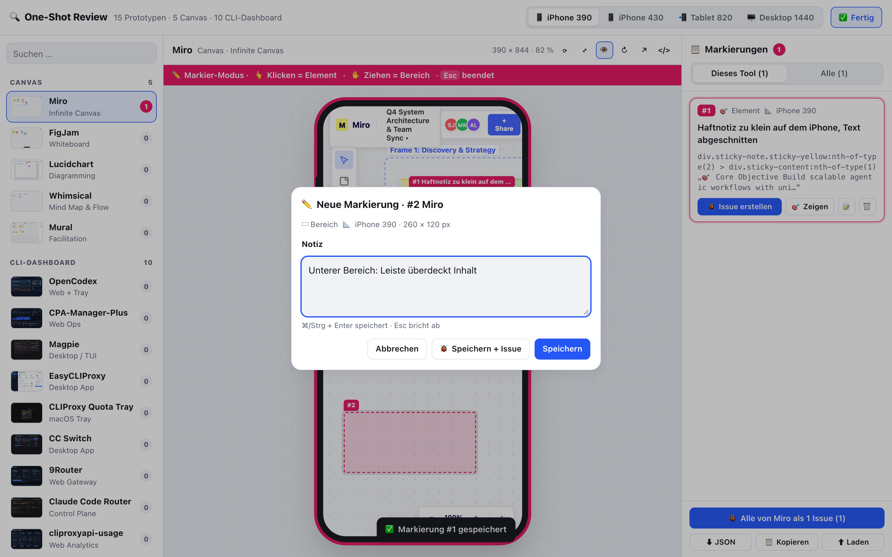
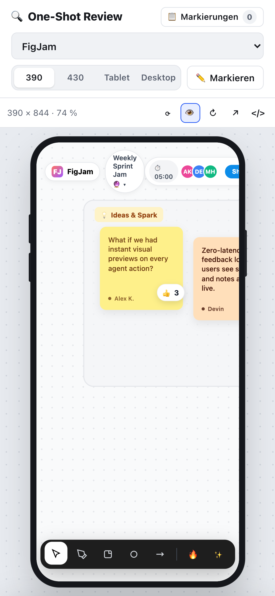
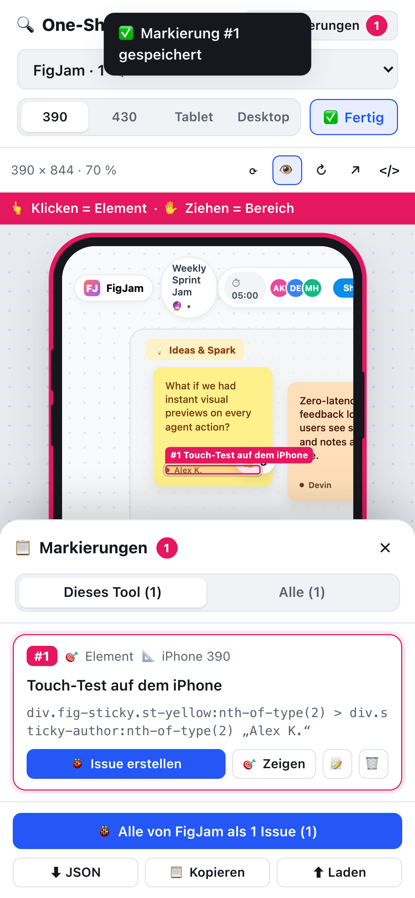
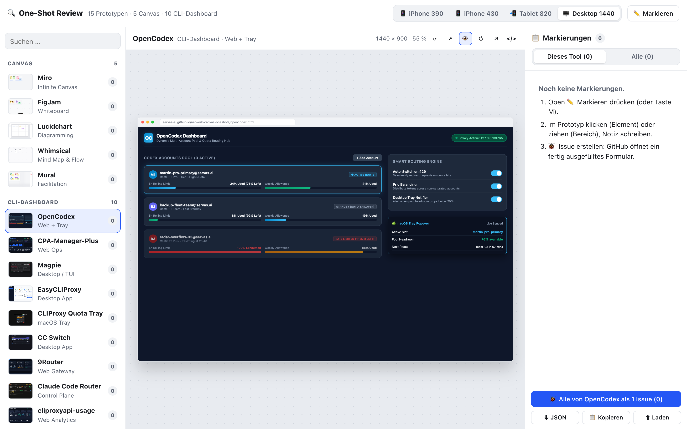
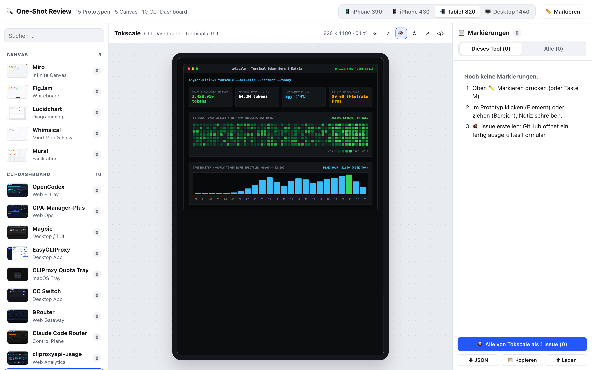

[ L13 · oneshots-review ] 🦀 CC · Claude Opus · 🧠 IDR: nein (Bau-Auftrag) · 🕐 2026-10-06

> 🧠 NotebookLM: – (kein IDR in dieser Lane)

# 🔍 One-Shot Review: Übersicht, Geräte-Größen, Live-Markierung → GitHub-Issue

**Live:** https://servas-ai.github.io/network-canvas-oneshots/
**Quelltext:** [`index.html`](https://github.com/servas-ai/network-canvas-oneshots/blob/feat/canvas-oneshots/index.html) · **OpenSpec:** [`oneshots-review-overview-20261006`](https://github.com/servas-ai/network-canvas-oneshots/blob/feat/canvas-oneshots/openspec/changes/oneshots-review-overview-20261006/proposal.md) (15/15 Tasks, `validate --strict` grün)

## ✅ Akzeptanz (E2E 38/38 gegen die echte Pages-URL, Brave headless, Temp-Profil)

- 🟢 **AC1** 15 Prototypen gelistet (5 Canvas · 10 CLI-Dashboard), gruppiert
- 🟢 **AC2** API ergänzt unbekannte `.html` als „Neu“ (gemockt geprüft) · API-403 → Manifest-Liste bleibt vollständig · **live auf Pages:** Contents-API 200, Liste bleibt 15 (5 Canvas · 10 CLI), kein falsches „Neu“, Puffer in sessionStorage gesetzt
- 🟢 **AC3** iframe-`innerWidth` = 390 / 430 / 820 / 1440, Geräte-Rahmen Telefon/Tablet/Browser
- 🟢 **AC4** Klick = Element (Selektor + Text), Ziehen = Bereich (40/600/260×120 px exakt), Esc verwirft
- 🟢 **AC5** Neuladen behält Markierungen · JSON-Download `oneshots-markierungen-2026-10-06.json`
- 🟢 **AC6** Issue-Link `issues/new?title=…&body=…` mit Tool, Gerät, Koordinaten, Element, Notiz, JSON · 4063 Zeichen · Bündel je Tool · kein Token
- 🟢 **AC7** Übersicht auf 390 px ohne horizontales Scrollen, Touch-Markierung + Bottom-Sheet
- 🟠 **AC8** Issue-Formular: GitHub antwortet 302 → Login, `return_to` behält Titel + Body 1:1. Das ausgefüllte Formular selbst nur eingeloggt sichtbar (nicht im Operator-Browser geprüft).

Ergebnis-Datei: [`2026-10-06_pages-e2e-result.json`](./2026-10-06_pages-e2e-result.json) · Test: [`2026-10-06_e2e.py`](./2026-10-06_e2e.py) · Beispiel-Issue-Body: [`2026-10-06_pages-issue-body.md`](./2026-10-06_pages-issue-body.md)

## 🖼️ Beweise (Pages-URL, selbst gesichtet)

**Markierungen auf iPhone 390 (Element #1, Bereich #2) + Liste mit „Issue erstellen“**

**Notiz-Dialog beim Markieren**

**Übersicht auf dem iPhone (390 px) · Markierungs-Liste als Sheet**
 

**CLI-Dashboards: OpenCodex Desktop 1440 · Tokscale Tablet 820**

## 🔁 Wiederverwendet

- **Element-Anker** aus `servas-ai/agent-installer` `apps/studio/canvas/anchors.mjs` @8b121524 (Tag, id/data-testid, Rolle, Name, Text, Klickpunkt), verkleinert.
- **Markierungs-Schema** (`art`, `x`, `y`, `breite`, `hoehe`) wie `services/baukasten-snipping`. Das Snipping selbst ist eine Node-CLI ohne UI, darum nicht direkt einbaubar.

## 👀 Bitte drüberschauen

- `feat/cli-dashboards` (3930442, Lane ws:52) per **Fast-Forward** auf `feat/canvas-oneshots` geholt, sonst wären die 10 Dashboards nicht auf Pages. Deren Galerie `index.html` heißt jetzt **`gallery.html`**. ws:52 soll `index.html` nicht mehr überschreiben.
- GitHub-API erlaubt ohne Token 60 Abrufe pro Stunde und IP (war zeitweise erschöpft). Dann gilt das Manifest. Neue One-Shots: `python3 scripts/update-manifest.py`.
