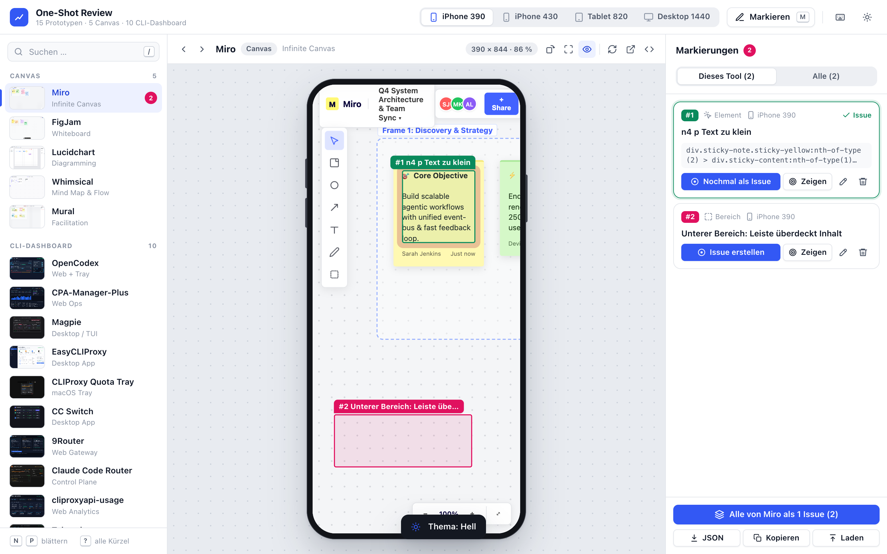
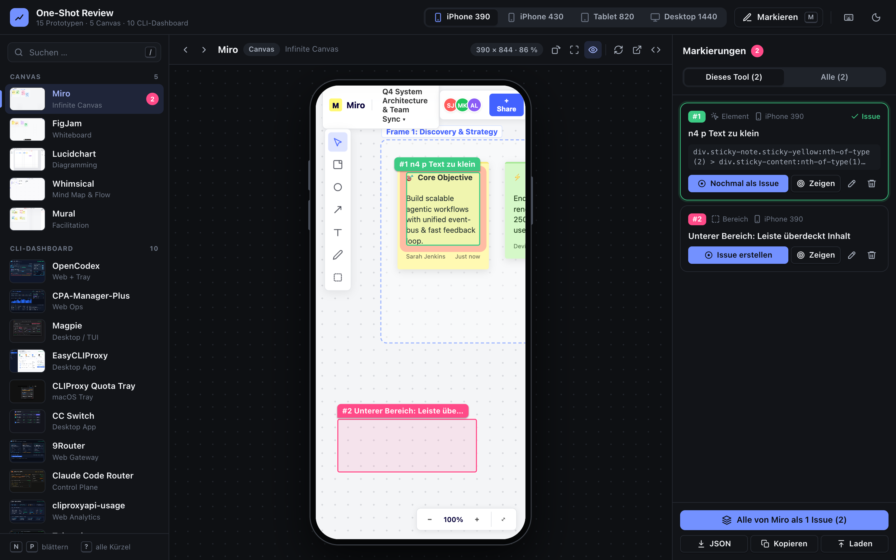
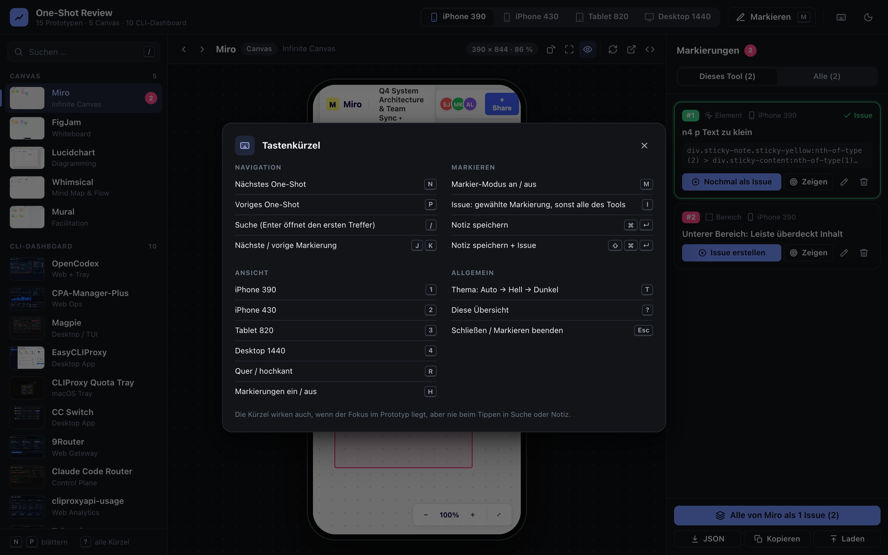
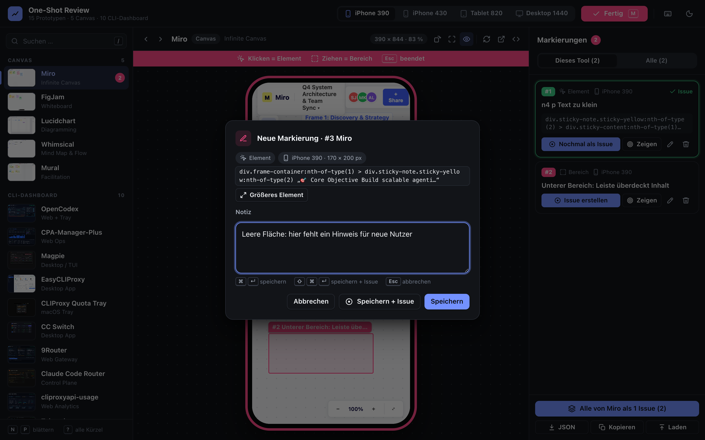
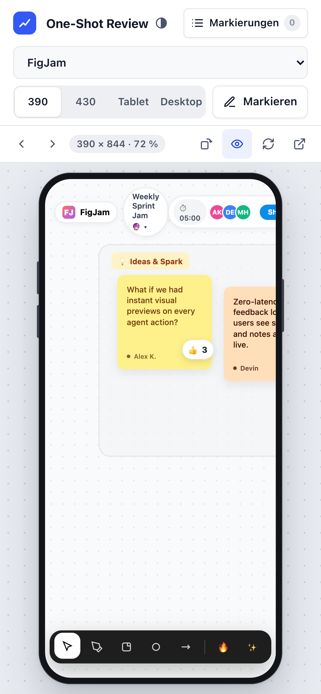
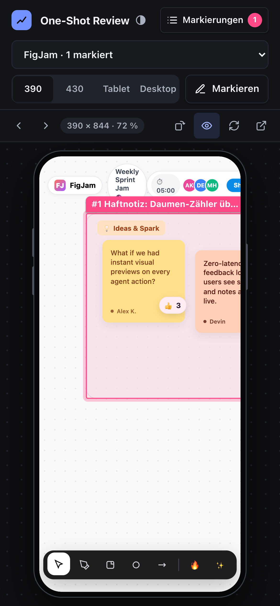
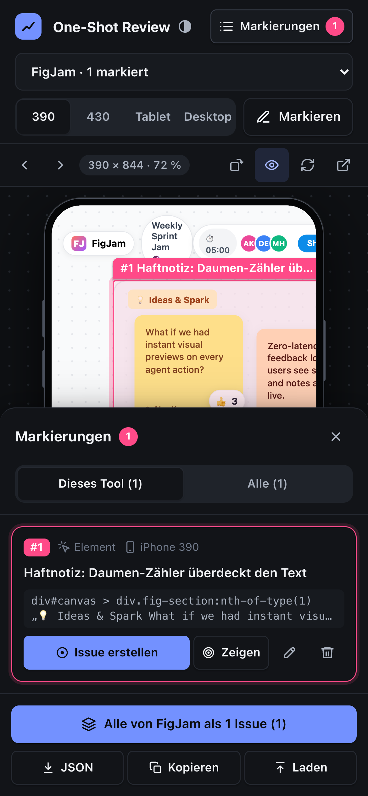

[ L13 · oneshots-review ] 🦀 CC · Claude Opus · 🧠 IDR: nein (Bau-Auftrag) · 🕐 2026-10-06

> 🧠 NotebookLM: – (kein IDR in dieser Lane)

# 🔁 One-Shot Review · Runden nach dem Goal-Update

**Live:** https://servas-ai.github.io/network-canvas-oneshots/ · **Ziele (Martin):**
1. UI deutlich schöner, mit Design-System, Dark/Light und mehr Tastenkürzeln
2. Voice-Notiz mit Zeiger-Position
3. V1/V2-Vergleich

**OpenSpec:**
- [`ui-shortcuts`](../openspec/changes/oneshots-review-ui-shortcuts-20261006/proposal.md)
- [`voice-notes`](../openspec/changes/oneshots-review-voice-notes-20261006/proposal.md)
- [`version-compare`](../openspec/changes/oneshots-review-version-compare-20261006/proposal.md)

Alle drei sind `validate --strict` grün.

---

## ✅ Runde 1 · Design-System, Hell/Dunkel, Tastenkürzel (Commit `fb4d5c7`)

**E2E gegen die echte Pages-URL** (Brave headless, Temp-Profil):
- **37/37 neu:** [`2026-10-06_r1-e2e-result.json`](./2026-10-06_r1-e2e-result.json)
- **38/38 alt:** Die bisherige Funktion bleibt grün.

- 🟢 **AC1 Tokens:** Farbe, Abstand (4er-Raster), Radius, Schrift, Schatten und Fokus sind CSS-Variablen. Außerhalb der Token-Blöcke steht keine einzige Hex- oder rgba-Farbe (statisch geprüft).
- 🟢 **AC2 Thema:** Auto, Hell und Dunkel, per Knopf oder `T`.
  - Die Wahl übersteht ein Neuladen.
  - Auto folgt dem System.
- 🟢 **AC3 Kürzel:**
  - `M` markieren, `I` Issue
  - `N`/`P` nächstes/voriges One-Shot
  - `1`–`4` Gerät, `/` Suche
  - `J`/`K` Markierungen, `R` quer, `H` ein/aus
  - `T` Thema, `?` Übersicht, `Esc`
  - **Fokus im Prototyp:** Die Kürzel greifen auch dann.
  - **Beim Tippen nie:** nicht in der Suche, nicht in der Notiz, nicht in editierbaren Haftnotizen.
- 🟢 **AC4 Übersicht:** `?` zeigt alle Kürzel. Jeder Knopf nennt seine Taste im Tooltip.
- 🟢 **AC5 Icons:** einheitliche SVG-Icons statt Emoji. Die Issue-Texte behalten ihre Emoji.
- 🟢 **AC6 iPhone 390:** kein seitliches Scrollen. Alle Bedien-Ziele sind mindestens 36 px groß, in Hell und Dunkel.
- 🐛 **Beim Testen gefunden und behoben:** Nach dem Schließen des Notiz-Dialogs blieb der Fokus auf dem unsichtbaren Textfeld. Dann waren alle Kürzel stumm, bis man irgendwo klickte.

**Hell · Markierungen.** Notiz #1 stammt aus dem Tipp-Schutz-Test: „n4 p“ wurde als Text getippt und löste keine Kürzel aus.

**Dunkel · Markierungen**

**Tastenkürzel (`?`)**

**Notiz-Dialog dunkel, mit Tastenhinweisen**

**iPhone 390: hell · dunkel mit Markierung · Liste als Sheet**
  

---

## 🔄 Runde 2 · Voice-Notiz (läuft)

- **Befund:** Der Grok-Voice-Harness auf `127.0.0.1:9381` lehnt fremde Origins bewusst ab (`requestAllowed`, `Sec-Fetch-Site: cross-site` → 403). Darum gibt es eine eigene Loopback-Brücke `scripts/voice-bridge.mjs` mit Allowlist und Token je Start. Sie leitet serverseitig an whisper.cpp und an den Harness weiter.

## ⏳ Runde 3 · V1/V2-Vergleich (geplant)

- **V2-Quelle:** Premium-Lane (`feat/premium-oneshots`, Sicherung `bf02f87`)
