[ L13 · oneshots-review ] 🦀 CC · Claude Opus · 🧠 IDR: nein (Bau-Auftrag) · 🕐 2026-10-06

> 🧠 NotebookLM: – (kein IDR in dieser Lane)

# 🔁 One-Shot Review · Runden nach dem Goal-Update

**Live:** https://servas-ai.github.io/network-canvas-oneshots/ · **Ziele (Martin):**
1. UI deutlich schöner, mit Design-System, Dark/Light und mehr Tastenkürzeln
2. Voice-Notiz mit Zeiger-Position
3. V1/V2-Vergleich

**OpenSpec:**
- [`ui-shortcuts`](../openspec/changes/oneshots-review-ui-shortcuts-20261006/proposal.md)
- [`voice-notes`](../openspec/changes/oneshots-review-voice-notes-20261006/proposal.md)
- [`version-compare`](../openspec/changes/oneshots-review-version-compare-20261006/proposal.md)

Alle drei sind `validate --strict` grün.

---

## ✅ Runde 1 · Design-System, Hell/Dunkel, Tastenkürzel (Commit `fb4d5c7`)

**E2E gegen die echte Pages-URL** (Brave headless, Temp-Profil):
- **37/37 neu:** [`2026-10-06_r1-e2e-result.json`](./2026-10-06_r1-e2e-result.json)
- **38/38 alt:** Die bisherige Funktion bleibt grün.

- 🟢 **AC1 Tokens:** Farbe, Abstand (4er-Raster), Radius, Schrift, Schatten und Fokus sind CSS-Variablen. Außerhalb der Token-Blöcke steht keine einzige Hex- oder rgba-Farbe (statisch geprüft).
- 🟢 **AC2 Thema:** Auto, Hell und Dunkel, per Knopf oder `T`.
  - Die Wahl übersteht ein Neuladen.
  - Auto folgt dem System.
- 🟢 **AC3 Kürzel:**
  - `M` markieren, `I` Issue
  - `N`/`P` nächstes/voriges One-Shot
  - `1`–`4` Gerät, `/` Suche
  - `J`/`K` Markierungen, `R` quer, `H` ein/aus
  - `T` Thema, `?` Übersicht, `Esc`
  - **Fokus im Prototyp:** Die Kürzel greifen auch dann.
  - **Beim Tippen nie:** nicht in der Suche, nicht in der Notiz, nicht in editierbaren Haftnotizen.
- 🟢 **AC4 Übersicht:** `?` zeigt alle Kürzel. Jeder Knopf nennt seine Taste im Tooltip.
- 🟢 **AC5 Icons:** einheitliche SVG-Icons statt Emoji. Die Issue-Texte behalten ihre Emoji.
- 🟢 **AC6 iPhone 390:** kein seitliches Scrollen. Alle Bedien-Ziele sind mindestens 36 px groß, in Hell und Dunkel.
- 🐛 **Beim Testen gefunden und behoben:** Nach dem Schließen des Notiz-Dialogs blieb der Fokus auf dem unsichtbaren Textfeld. Dann waren alle Kürzel stumm, bis man irgendwo klickte.

**Hell · Markierungen.** Notiz #1 stammt aus dem Tipp-Schutz-Test: „n4 p“ wurde als Text getippt und löste keine Kürzel aus.

**Dunkel · Markierungen**

**Tastenkürzel (`?`)**

**Notiz-Dialog dunkel, mit Tastenhinweisen**

**iPhone 390: hell · dunkel mit Markierung · Liste als Sheet**
  

---

## ✅ Runde 2 · Voice-Notiz mit Zeiger-Position (Commits `4a1aee0` · `2626780` · `f9769bc`)

**E2E gegen die echte Pages-URL: 27/27** ([`2026-10-06_r2-e2e-result.json`](./2026-10-06_r2-e2e-result.json)). Echte Brücke, echtes whisper.cpp (`ggml-base`), synthetische Sprache (macOS `say`, Stimme Anna) über ein Test-Mikrofon.

- 🟢 **AC1 Zeigen + Sprechen:** Satz 1 über dem Share-Knopf, Zeiger bewegt, Satz 2 über dem Haftnotiz-Werkzeug. Daraus werden 2 Markierungen auf 2 Elementen. Die Koordinaten sind exakt das Element-Rechteck zum Sprech-Zeitpunkt (`[323, 15, 64, 42]`).
- 🟢 **AC2 Hook:** 4 Adapter (whisper, grok, browser, tippen). Ein eigener Adapter geht per `window.OneshotsVoice.register(…)`, im Test geprüft.
- 🟢 **AC3 Brücke** `scripts/voice-bridge.mjs`:
  - nur 127.0.0.1
  - Allowlist und Token je Start, nie im Code
  - Host-Prüfung, Private-Network-Preflight
  - Der Harness-Schutz bleibt unangetastet.
- 🟢 **AC4 whisper.cpp:** „Der Knopf ist viel zu klein.“ und „Hier fehlt eine Überschrift.“ wurden wörtlich erkannt.
- 🟢 **AC5 Live:** Pegel, „Hört zu …“, Entwurfs-Rahmen am Element.
- 🟢 **AC6 Rückfall:** Ohne Brücke kommt eine klare Meldung mit Startbefehl. Sperrt der Browser das lokale Netzwerk, sagt die Seite das. „Tippen“ öffnet die Notiz am Zeiger.
- 🟠 **AC7 Grok:** Der echte Harness auf :9381 antwortet über die Brücke (Status, Einwilligung an). Eine Live-Sitzung habe ich nicht gestartet: Sie nutzt Martins Grok-Konto, und der Harness-Vertrag nennt ein AGB-Risiko.
- 🐛 **Gefunden und behoben:**
  - Brave 154 (Chromium 142+) fragt vor dem Zugriff einer https-Seite auf 127.0.0.1 (Local Network Access). Die Seite erkennt das jetzt.
  - Der Aufnahme-Knopf war blau statt rot.
  - Doppelte Abzeichen beim Anhängen sind weg.

**Live beim Sprechen** (Entwurf am Share-Knopf, Pegel-Leiste)
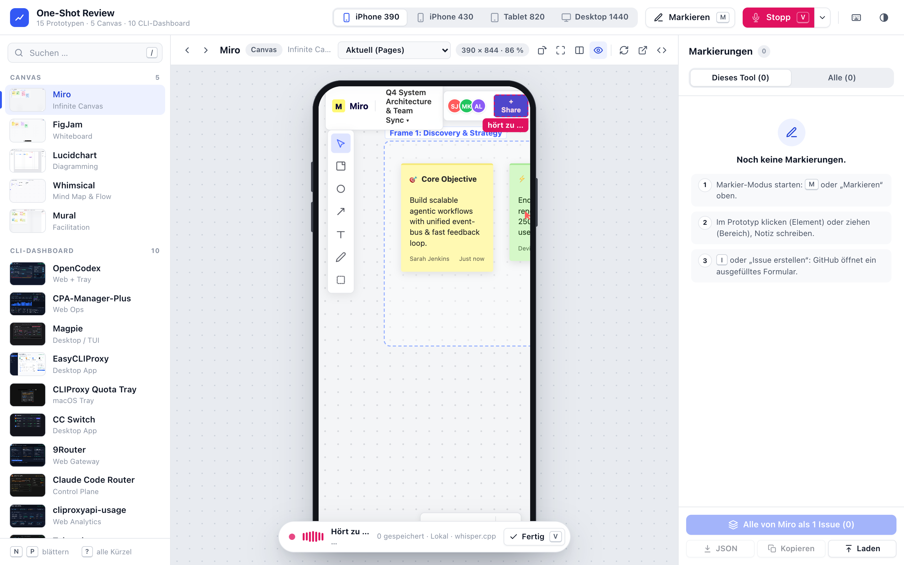

**Ergebnis:** zwei Sprach-Notizen auf zwei Elementen, Chip „Sprache“
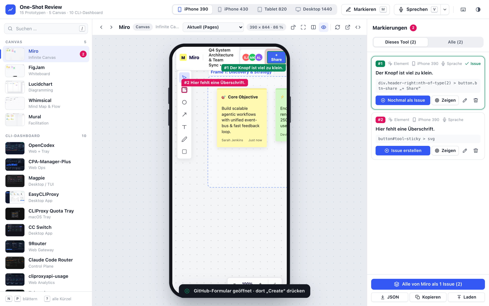

**Sprach-Einstellungen** (4 Adapter mit Status, Brücke verbunden)
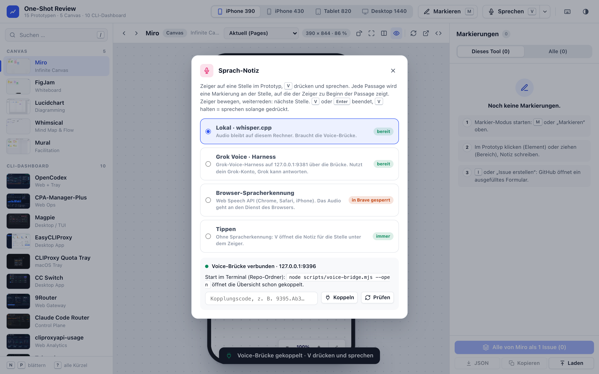

**iPhone dunkel:** antippen, sprechen, Aufnahme rot · **Browser sperrt 127.0.0.1:** Die Seite nennt den Schalter „Lokales Netzwerk“
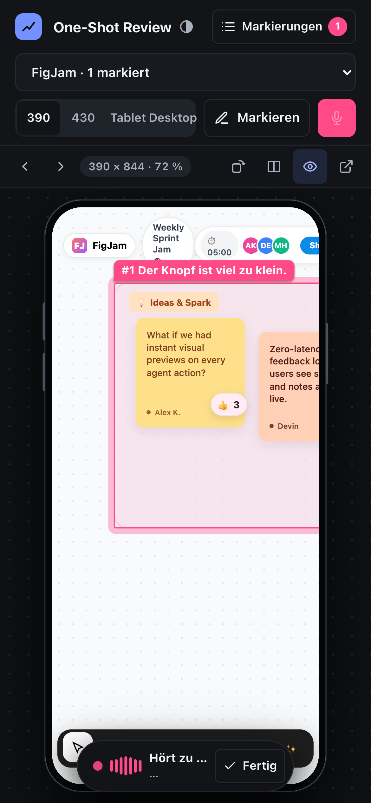 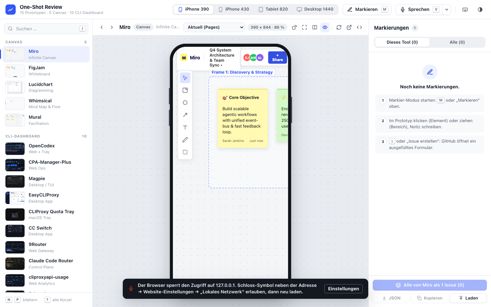

---

## ✅ Zusatz · Ablauf-Ansicht: Issue je Knoten (servas-ai/radar, Branch `feat/ablauf-issue-overlay-20261006`, Commit `47f6249d`)

- **Zuständigkeit geprüft:**
  - `apps/ablauf-ur` und die Server :9275/:9272/:9261 gehören der Lane kira-linux-rahmen.
  - `apps/ablauf-flow` ist gefroren.
  - Darum baue ich **nichts an der App**, sondern ein Overlay: Der Proxy `apps/ablauf-issues/server.mjs` auf 127.0.0.1:9276 reicht :9275 samt HMR durch und blendet ein Skript ein.
- **E2E gegen die laufende :9275: 26/26.** Alle 70 Knoten haben einen Issue-Knopf. Die vorausgefüllte Issue-URL enthält `labels=ablauf` und den Marker ``Ablauf-Knoten: `<id>` ``. Den Live-Status liest der Proxy über `gh` (radar ist privat): 49 Knoten offen, 21 ohne Issue. #220 ist laut Overlay offen, laut `gh issue view` OPEN.
- **Beweisbilder:** im radar-Branch unter `.proof/2026-10-06_ablauf-*.png`, privat.

## ✅ Runde 3 · V1/V2-Vergleich (Commits `0eb7532` · `475bce5` · `59f44ff`)

**E2E gegen die echte Pages-URL: 22/22** ([`2026-10-06_r3-e2e-result.json`](./2026-10-06_r3-e2e-result.json)). V2 ist die echte Premium-Fassung der Premium-Lane (`feat/premium-oneshots` @ `bbb9e60`), geladen von GitHub.

- 🟢 **AC1 Ansichten:** Nebeneinander, Schieber (ziehen oder `←` `→`), Überblenden (Regler). `C` öffnet, `Esc` schließt.
- 🟢 **AC2 Versionen:**
  - Aktuell und die Manifest-Ref „Premium (V2)“
  - alle Branches, der Datei-Verlauf und eine beliebige Ref (im Test Commit `bf02f87`)
  - Bei API-Limit bleiben Manifest-Ref und freie Ref nutzbar.
- 🟢 **AC3 Gleiche Herkunft:** raw → `srcdoc`. Markieren (und Sprach-Notiz) gehen auf V2. Die Markierung speichert `ref` und `sha` (`bbb9e60`).
- 🟢 **AC4:** Gerät je Seite (A iPhone 390, B Desktop 1440). Scroll-Kopplung ist an- und abschaltbar. `1`–`4` stellt beide Seiten um.
- 🟢 **AC5 Echte Daten:** Canvas (Miro) und CLI (OpenCodex, 9router), V1 gegen V2.
- 🟢 **AC6 Teilen:** `?vergleich=feat/premium-oneshots&modus=schieber` öffnet dieselbe Ansicht. Das Vergleichs-Issue nennt A und B mit Ref, Link und Urteil-Checkliste ([Beispiel-Body](./2026-10-06_r3-vergleich-issue-body.md)).
- 🔎 **Weitergedacht:**
  - „Auf B markieren“ (`M` im Vergleich) öffnet B direkt im Markier-Modus.
  - Die Versions-Auswahl in der Leiste wählt V2 auch ohne Vergleich.
  - Markierungen gelten je Version.
- 🔎 **Befund aus den Daten:** Fast alle V1-One-Shots scrollen auf dem iPhone nicht auf Seitenebene (feste App-Layouts), die Premium-V2 schon (OpenCodex 1098 px, EasyCLIProxy 2328 px).
- 🐛 **Gefunden und behoben:**
  - Die Klasse des Schieber-Trenners kollidierte mit dem Kopfzeilen-Trennstrich.
  - Auf dem iPhone entstand 1 px seitliches Scrollen.
  - Labels und A/B-Etiketten auf dem iPhone überlappten.

**Miro · Nebeneinander** (A V1 · B Premium V2)
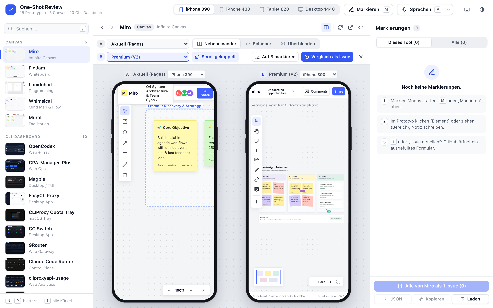

**Miro · Schieber** bei 30 %
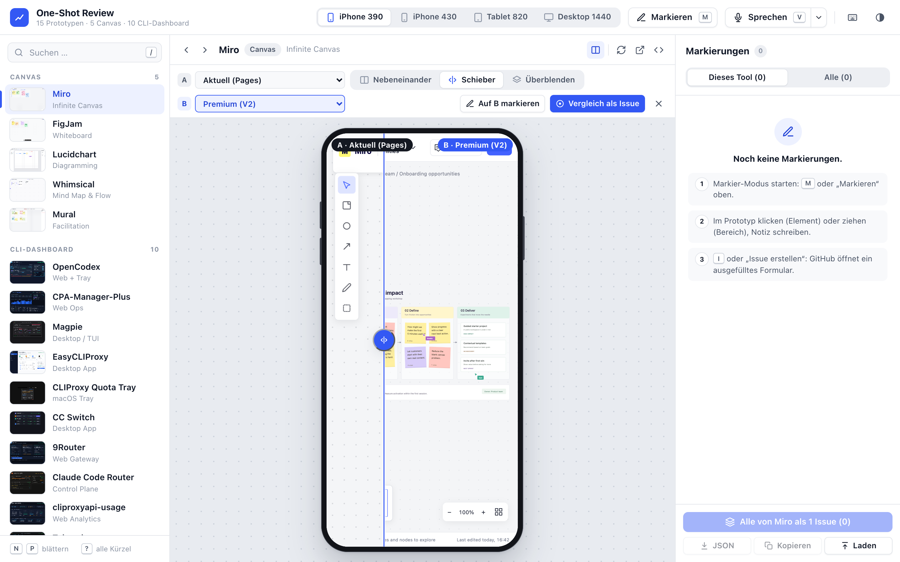

**Miro · Überblenden** 70 % B
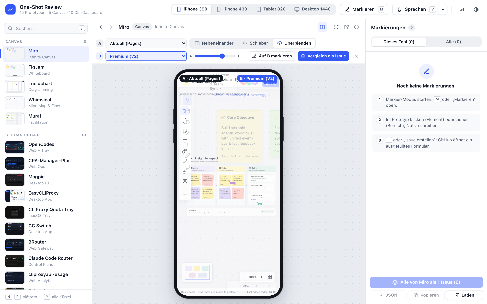

**OpenCodex (CLI) · Desktop 1440 nebeneinander**
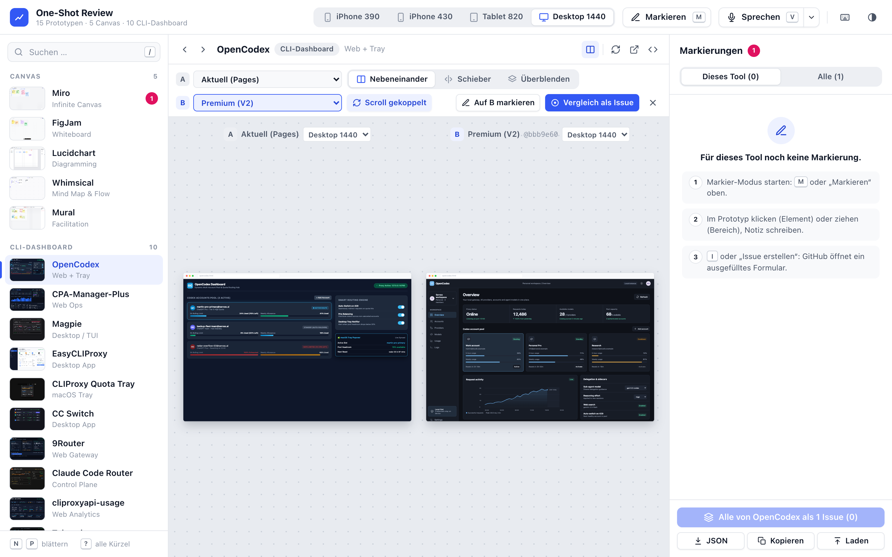

**Markierung auf V2** (Share-Knopf der Premium-Fassung, Chip „Premium (V2)“) · **iPhone: Schieber**
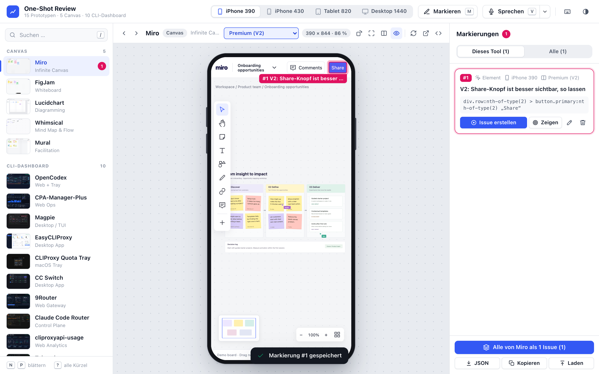 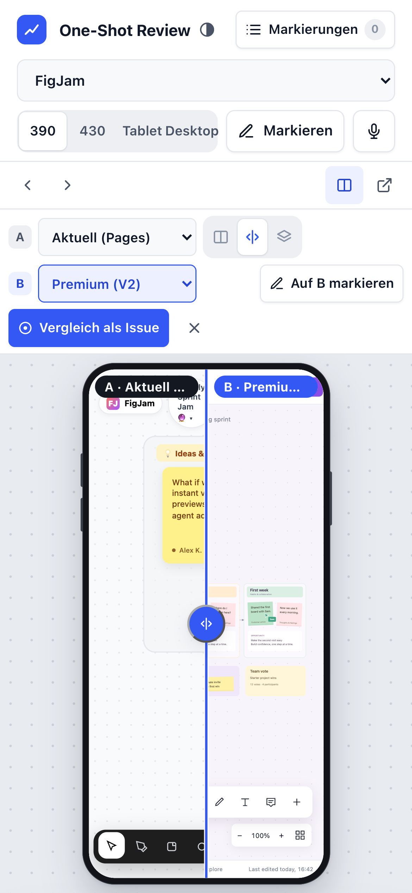

---

## 🧾 Gesamt (Pages, letzter Lauf)

- **Alt:** 38/38
- **Runde 1:** 37/37
- **Runde 2:** 27/27
- **Runde 3:** 22/22
- **Ablauf-Overlay:** 26/26 (lokal gegen :9275)
- **Testskripte:** `.proof/2026-10-06_e2e*.py`
